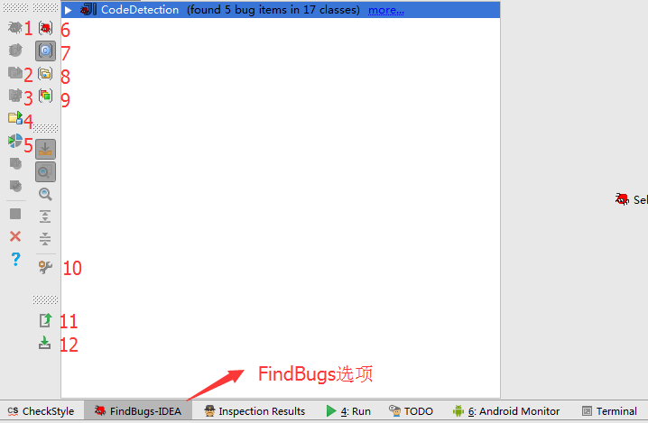
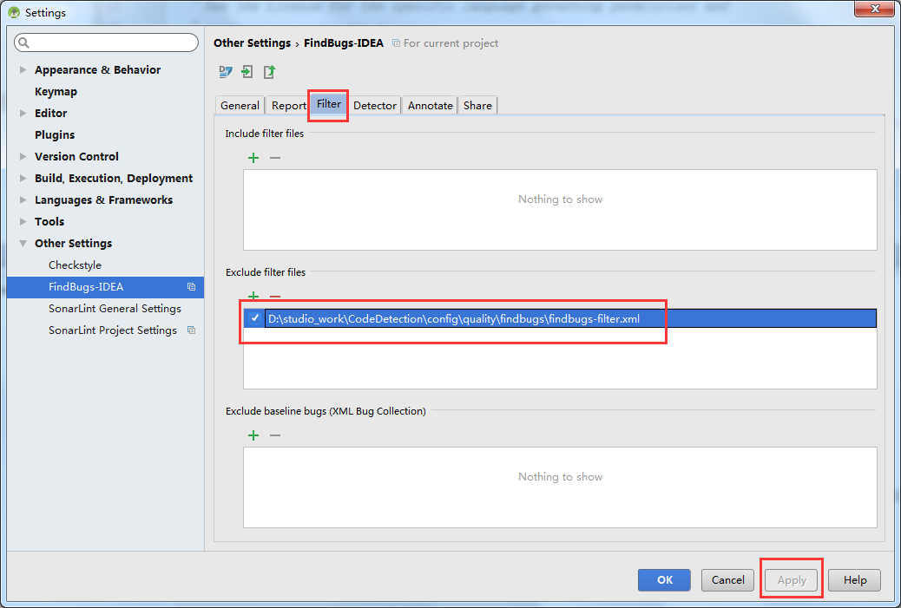

---
title: FindBugs代码检查工具
date: 2017-10-24 17:00:05
tags: [Android]
categories: [代码检查工具,by曾浩]
---

在项目中集成FindBugs能检查出代码中的潜在Bugs，自动地静态代码分析，极大地保证了项目的代码质量，下面就简单介绍一下，FindBugs的接入和配置。

<!-- more -->

### 下载插件

打开android studio的settingds->Plugins->Browse Repositories搜索findbugs，选择FindBugs，点击右边的Install，下载好之后重启android studio。

### 简单集成

在build.gradle文件中写入：

```java
apply plugin: 'findbugs'
...
...
task findbugs(type: FindBugs, dependsOn: "assembleDebug") {
    ignoreFailures = false
    effort = "max"
    reportLevel = "high"
    classes = files("${project.rootDir}/app/build/intermediates/classes")

    source  = fileTree("src/main/java/")

    reports {
        xml.enabled = false
        html.enabled = true
        xml {
            destination "$reportsDir/findbugs/findbugs.xml"  //这里是报告产生的路径
        }
        html {
            destination "$reportsDir/findbugs/findbugs.html"  //这里是报告产生的路径
        }
    }

    classpath = files()
}
```

### FindBugs按钮说明



1. 当前文件检查；
2. 当前包路径下代码检查；
3. 当前模块检查；
4. 当前项目检查；
5. 自定义文件检查
6. 检查结果按Bug分类
7. 检查结果按文件分类
8. 检查结果按包路径分类
9. 检查结果按Bug级别分类
10. FindBugs配置
11. 把检查结果导出
12. 导入检查结果

### 设置过滤文件

点击上图的`12`按钮



点击`Filter->Exclude filter files`下的`+`号选中自定义的过滤文件，然后点击`Apply`。

`findbugs-filter.xml`

```xml
<?xml version="1.0" encoding="UTF-8"?>
<FindBugsFilter>
    <!-- http://stackoverflow.com/questions/7568579/eclipsefindbugs-exclude-filter-files-doesnt-work -->
    <Match>
        <Class name="~.*\.R\$.*"/> // 过滤R文件
    </Match>
    <Match>
        <Class name="~.*\.Manifest\$.*"/> // 过滤Mainifest文件
    </Match>
    <!-- All bugs in test classes, except for JUnit-specific bugs -->
    <Match>
        <Class name="~.*\.*Test" />
        <Not>
            <Bug code="IJU" />
        </Not>
    </Match>
</FindBugsFilter>
```

