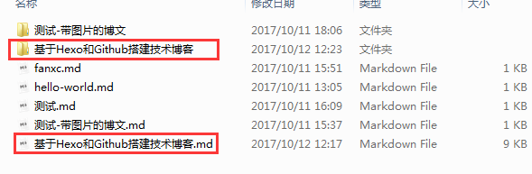

## 前言
当前比较流行的方法就是Hexo与Github搭建博客。Hexo是一个快速、简洁且高效的博客框架，有比较丰富的主题和插件支持。
Github为用户提供了Github Pages，其空间免费稳定，非常适合搭建个人博客。下面就为大家介绍如何使用Hexo和Github来搭
建一个技术博客。
<!--more-->
## 准备工作
需要先安装以下两个软件：

[nodejs](https://nodejs.org/) 	我这里下载的是`6.11.1`版本

[git](https://git-scm.com/)

## 安装Hexo
① 安装
打开cmd.exe，输入以下命令，安装Hexo
```bash
npm install hexo-cli -g
```
② 初始化
在你任意文件夹中创建一个用来存放博客的文件夹，我这里选的是 `E:\MyBlog`；
在跟目录文件夹下输入以下命令进行初始化：
```bash
hexo init
```
然后输入
```bash
npm install
```
再输入：
```bash
hexo g
```
最后输入：
```bash
hexo s
```
此时博客就创建好了，你可以打开`localhost:4000`这个链接查看。
介绍以下，hexo常用命令：
`hexo init` //初始化一个文件夹，它会为这个文件夹配置所有骨架
`hexo g` //即hexo generate，生成静态文件
`hexo s` //即hexo server，创建服务
`hexo d` //即hexo deploy,用于将本地文件发布到github上
`hexo n` //即hexo new,用于新建一篇文章
现在只是在本地搭建了一个技术博客，要想把博客内容让所有人都能看到，就得借助Github了，把博客内容部署到Github上去。

## 部署至Github
① 在Github注册一个账号，并创建一个仓库。
② 仓库名要设置和用户名相同，所以我这仓库名设置为`morningtec-moblie.github.io`
③ 将Github账号密码设置到本地git中，你也可以配置SSH
④ 将博客的根目录的`_config.yml`文件的底部`deploy`设置为：
```bash
deploy:
  type: git
  repository: https://github.com/morningtec-moblie/morningtec-moblie.github.io.git
  branch: master
```
<font color="red">注意：冒号（:）后都有一个空格。</font>你可以把此段代码复制过去，并把`https://github.com/morningtec-moblie/morningtec-moblie.github.io.git`替换为你自己的Github仓库路径
⑤ 部署：
在跟目录文件夹下输入`hexo g`，在输入`hexo d`，如果此时报错你可以输入`npm install hexo-deployer-git --save`来解决
⑥ 如果上面都没什么问题的话，访问`morningtec-moblie.github.io`就能看到自己的博客了。

## 绑定域名
① 去各大域名提供商购买我们心仪的域名，比如说阿里云、腾讯、万网等，此处不再赘述。然后进行如下配置：
② 域名解析：以万网为示例，登录进入万网的域名控制台，点击”域名和网站”中的”云DNS”
③ 点击对应域名的”解析”
④ 点击添加解析，记录类型选A或CNAME，A记录的记录值就是ip地址，github(官方文档)提供了两个IP地址，192.30.252.153和
192.30.252.154，这两个IP地址为github的服务器地址，两个都要填上，解析记录设置两个www和@，线路就默认就行了，
CNAME记录值填你的github博客网址。如我的是morningtec-moblie.github.io
⑤ HEXO根目录的SOURCE文件夹里创建CNAME文件，不带任何后缀，里面添加你的域名信息，如：blog.morningtec.cn


## 配置Hexo主题：

可能你觉得默认主题不太好看，想要设置喜欢主题。我在这把主题设置为`next`，最火的hexo的主题。
在跟目录文件夹下输入：`git clone https://github.com/iissnan/hexo-theme-next themes/next`下载next主题。
下面我会把`E:\MyBlog\_config.yml`文件称为`站点配置`，把`E:\MyBlog\themes\next\_config.yml`文件称为`主题配置`
下载完成后，将`站点配置`文件的`theme`字段的值改为`next`，重新编译并上传到Github上后，访问博客链接，你就会发现主题已经改成next了，next的默认语言为英文，你可以更改为简体中文，找到并打开`站点配置`文件，找到`language`字段，将值改为`zh-Hans`。这里介绍下`站点配置`文件部分字段的含义：
```json
title: 晨之科SDK团队博客 // 博客名称
subtitle:			   // 博客副名称
description:           // 描述
author: 晨之科SDK团队    // 作者
language: zh-Hans      // 语言
```

## 设置NexT的菜单：
编辑 `主题配置`文件，修改以下内容：
设定菜单内容，对应的字段是 menu。 菜单内容的设置格式是：item name: link。其中 item name 是一个名称，这个名称并不直接显示在页面上，她将用于匹配图标以及翻译。
```bash
menu:
  home: /
  archives: /archives
  #about: /about
  #categories: /categories
  tags: /tags
  #commonweal: /404.html
```

删除`#`就可以在博客内开启相应的菜单

NexT 默认的菜单项有:

|     键值     |           设定值           | 显示文本（简体中文） |
| :--------: | :---------------------: | :--------: |
|    home    |         home: /         |     主页     |
|  archives  |   archives: /archives   |    归档页     |
| categories | categories: /categories |    分类页     |
|    tags    |       tags: /tags       |    标签页     |
|   about    |      about: /about      |    关于页面    |
| commonweal |  commonweal: /404.html  |   公益 404   |

到这里，你已经开启了菜单页面，并没有创建，想要创建菜单页面，在跟目录文件夹下输入`hexp new page “tags” `，创建tag页面，其他的页面你也可以相应的创建出来。

## 设置小图片：
将 favicon.ico 文件放在`E:\MyBlog\source`目录下
## 设置头像：
将头像图片放在`E:\MyBlog\themes\next\source\images`目录下，并在主题配置的avatar的字段的值改为`/images/你的图片文件`
## 设置404公益页面：
在`E:\MyBlog\source`目录下新建 `404.html` 页面，`404.html`内容为：
```htmlbars
<span style="font-size:14px;">
<html>  
    <head>  
         <meta http-equiv="Content-Type" content="text/html; charset="UTF-8" />  
         <title>公益404</title>                                                                                                                                          
    </head>  
    <body>  
         <script type="text/javascript" 
         src="http://www.qq.com/404/search_children.js" 
         charset="utf-8" 
         homePageUrl="http://blog.morningtec.cn" 
         homePageName="回到我的主页">
         </script>  
    </body>  
</html>
</span> 
```
## 设置本地站内搜索：
① 安装 `hexo-generator-searchdb`，在站点的根目录下执行以下命令：

`npm install hexo-generator-searchdb --save`

② 编辑`站点配置`文件，新增以下内容到任意位置：
```json
search:
  path: search.xml
  field: post
  format: html
  limit: 10000 
```
③编辑`主题配置`文件，启用本地搜索功能：
```json
# Local search
local_search:
  enable: true
```
## 设置评论功能：
由于`多说`和`网易云跟帖`都已停止了服务，所以我在这选择了`LiveRe`服务
① 注册LiveRe，LiveRe分为`City 版`（免费版本）`Premium 版`（收费版本）；选择免费版本就行。
② 注册完成后，获取到`data-uid`，编辑 `主题配置`文件， 编辑 livere_uid 字段，设置如下：
`livere_uid: #your livere_uid`

## 团队成员发布文章：
① 先去`github`上把仓库下载下来，执行以下命令`https://github.com/morningtec-moblie/MTBlog.git`

② 在`source/_posts/`文件夹下，新建一个`MarkDown`格式的文章。添加文章属性（例如）：

```bash
---
title: 基于Hexo和Github搭建技术博客 // 博文标题
date: 2017-09-28 16:30:05		// 日期
tags: [hexo,github]            // 标签
categories: 搭建博客           // 分类
comments: false               // 评论功能，默认开启
---
```


③ 如果需要文章需要图片，在`source/_posts/`文件夹内新建一个和博客标题名一样的文件夹，把图片放置内，然后再`MarkDown`里引用（例如）：

`MarkDown的图片命令：`



④ 文章写完后，再推送到`github`上，然后会有人在某一时刻上传到博客。

## 创建文章并发布到博客：
站点的根目录下执行以下命令来创建一篇文章：
`hexo new 基于Hexo和Github搭建技术博客`
通过关键字来指定文章的分类、标签及是否开启评论等功能。
```bash
---
title: 基于Hexo和Github搭建技术博客
date: 2017-09-28 16:30:05
tags: [hexo,github]            // 标签
categories: 搭建博客           // 分类
comments: false               // 评论功能，默认开启
---
```
## 设置博文图片

把需要的图片放置在`你的博客路径\source\_posts\你的博客文件夹`，之后按照正常的方法使用，例如：

```bash
这是一张图片
```


## 设置阅读全文

```bash
  文章标题
  文章摘要
<!--more-->
  文章正文
```
